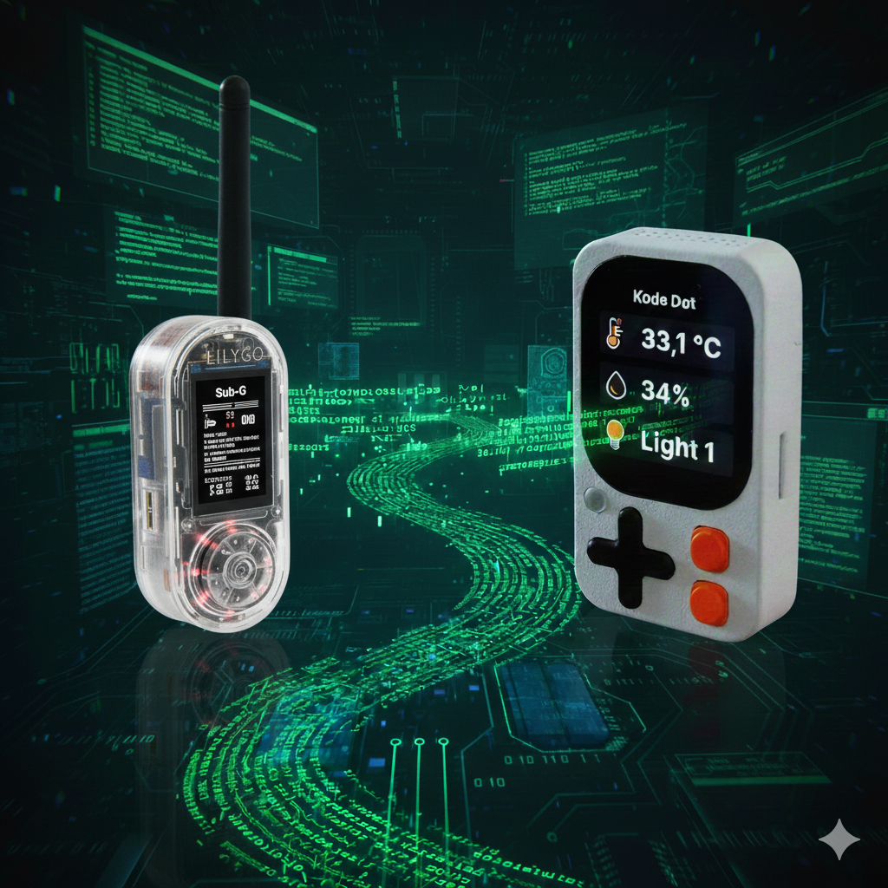

# ESP32
<br>This is a collection of code snippets to get started on my ESP32 learning journey. I pre-ordered a Kode Dot and since it will take until mid 2026 for it to arrive, I wanted to get a head start on learning programming the ESP32 in C. Completed code will be uploaded in this repo. I am using a T-Embed CC1101 as starting device.
***
<details>
  <summary>Arduino IDE Settings for ESP32-S3 N16R8</summary>
  <ul>
    <li>Select ESP32S3 Dev Module</li>
    <li>Change Flash Size to 16 MB</li>
    <li>Set to 16MB Flash (3MB APP/9.9MB FATFS)</li>
    <li>Set to OPI PSRAM (for Octal SPI PSRAM)</li>
    <li>Set Upload Speed to 921600</li>
    <li>Set to Hardware CDC and JTAG and USB CDC On Boot to Enabled (for USB programming)</li>
  </ul>
</details>
<details>
  <summary>Wifi Code Privat Network</summary>
  
  ```c
#include <WiFi.h>  
const char* ssid = "Your_SSID";
const char* password = "Your_Password";
  
void setup() {
  Serial.begin(115200);
  WiFi.mode(WIFI_STA); // Set as Station mode
  WiFi.begin(ssid, password);
  Serial.print("Connecting to WiFi");
  while (WiFi.status() != WL_CONNECTED) {
    delay(500);
    Serial.print(".");
  }
  Serial.println("\nConnected!");
  Serial.print("IP Address: ");
  Serial.println(WiFi.localIP());
}
```

</details>
<details>
  <summary>Wifi Code for Hotel Wifi</summary>

  ```c
#include <WiFi.h>
#include <esp_wifi.h>
  
// 1. Enter the MAC address of the device (Phone/Laptop) you used to login
//    Format: {0x00, 0x00, 0x00, 0x00, 0x00, 0x00}
uint8_t newMACAddress[] = {0xAC, 0x12, 0x34, 0x56, 0x78, 0x9A};  
const char* ssid = "Hotel_WiFi_Name";
const char* password = ""; // Usually empty for open portal networks
  
void setup() {
  Serial.begin(115200);
  // 2. Set WiFi mode to Station BEFORE changing MAC
  WiFi.mode(WIFI_STA);
  // 3. Spoof the MAC address
  esp_wifi_set_mac(WIFI_IF_STA, &newMACAddress[0]);
  // 4. Connect
  WiFi.begin(ssid, password);
  Serial.print("Connecting to Hotel WiFi");
  while (WiFi.status() != WL_CONNECTED) {
    delay(500);
    Serial.print(".");
  }
  Serial.println("\nConnected! Portal bypassed.");
  Serial.print("IP Address: ");
  Serial.println(WiFi.localIP());
}
  
void loop() {
  // Your code here
}
```

</details>
<details>
  <summary>Request BTC Price in EUR and USD using ArduinoJson Library</summary>

``` c
#include <HTTPClient.h>
#include <ArduinoJson.h>

const char* serverName = "https://api.coingecko.com/api/v3/simple/price?ids=bitcoin&vs_currencies=usd,eur";

void loop() {
  if (WiFi.status() == WL_CONNECTED) {
    HTTPClient http;

    // Begin the request
    http.begin(serverName);
    int httpResponseCode = http.GET();

    if (httpResponseCode > 0) {
      String payload = http.getString();
      
      // Parse JSON
      JsonDocument doc;
      DeserializationError error = deserializeJson(doc, payload);

      if (!error) {
        float btcUsd = doc["bitcoin"]["usd"];
        float btcEur = doc["bitcoin"]["eur"];

        Serial.println("--- Bitcoin Price ---");
        Serial.print("USD: $");
        Serial.println(btcUsd);
        Serial.print("EUR: €");
        Serial.println(btcEur);
      } else {
        Serial.print("JSON Parse failed: ");
        Serial.println(error.c_str());
      }
    } else {
      Serial.print("Error on HTTP request: ");
      Serial.println(httpResponseCode);
    }
    
    http.end();
  }

  // Wait 1 minute before next update (Free tier limit friendly)
  delay(60000);
}
```
</details>
<details>
  <summary>Request BTC Price in EUR and USD No Library</summary>

  ```c
#include <HTTPClient.h>

const char* serverName = "https://api.coingecko.com/api/v3/simple/price?ids=bitcoin&vs_currencies=usd,eur";

void loop() {
  if (WiFi.status() == WL_CONNECTED) {
    HTTPClient http;
    http.begin(serverName);
    int httpCode = http.GET();

    if (httpCode == 200) {
      String payload = http.getString(); // Example: {"bitcoin":{"usd":43500,"eur":40100}}

      // Extract USD
      String usdKey = "\"usd\":";
      int usdStart = payload.indexOf(usdKey) + usdKey.length();
      int usdEnd = payload.indexOf(",", usdStart);
      String usdPrice = payload.substring(usdStart, usdEnd);

      // Extract EUR
      String eurKey = "\"eur\":";
      int eurStart = payload.indexOf(eurKey) + eurKey.length();
      int eurEnd = payload.indexOf("}", eurStart); // EUR is the last item
      String eurPrice = payload.substring(eurStart, eurEnd);

      Serial.println("--- BTC Manual Parse ---");
      Serial.println("USD: $" + usdPrice);
      Serial.println("EUR: €" + eurPrice);
    }
    http.end();
  }
  delay(60000);
}
```

</details>
<details>
  <summary>T-Embed CC1101 Display</summary>

  ```c
#include "TFT_eSPI.h" 

// LORA
#define BOARD_LORA_CS   12
// TF card
#define BOARD_SD_CS   13

// About LCD definition in the file: lib/TFT_eSPI/User_Setups/Setup214_LilyGo_T_Embed_PN532.h
TFT_eSPI tft;

void setup(void)
{
    // LORA、SD and LCD use the same spi, in order to avoid mutual influence; 
    // before powering on, all CS signals should be pulled high and in an unselected state;
    pinMode(TFT_CS, OUTPUT);
    digitalWrite(TFT_CS, HIGH);
    pinMode(BOARD_SD_CS, OUTPUT);
    digitalWrite(BOARD_SD_CS, HIGH);
    pinMode(BOARD_LORA_CS, OUTPUT);
    digitalWrite(BOARD_LORA_CS, HIGH);
    
    tft.begin();
    tft.setRotation(3);
    tft.fillScreen(TFT_BLACK);

}

void loop(void)
{
    tft.fillScreen(TFT_RED);
    delay(1000);
    tft.fillScreen(TFT_GREEN);
    delay(1000);
    tft.fillScreen(TFT_BLUE);
    delay(1000);
    tft.fillScreen(TFT_LIGHTGREY);
    delay(1000);
    tft.fillScreen(TFT_BLACK);
    delay(1000);

    tft.setTextColor(TFT_GREEN, TFT_BLACK);
    tft.setRotation(3);
    tft.drawString(" !\"#$%&'()*+,-./0123456", 0, 0, 2);
    tft.drawString("789:;<=>?@ABCDEFGHIJKL", 0, 16, 2);
    tft.drawString("MNOPQRSTUVWXYZ[\\]^_`", 0, 32, 2);
    tft.drawString("abcdefghijklmnopqrstuvw", 0, 48, 2);
    delay(1000);

    tft.setRotation(2);
    tft.fillScreen(TFT_BLACK);
    tft.drawString(" !\"#$%&'()*+,-./0123456", 0, 0, 2);
    tft.drawString("789:;<=>?@ABCDEFGHIJKL", 0, 16, 2);
    tft.drawString("MNOPQRSTUVWXYZ[\\]^_`", 0, 32, 2);
    tft.drawString("abcdefghijklmnopqrstuvw", 0, 48, 2);
    delay(1000);

    tft.setRotation(1);
    tft.fillScreen(TFT_BLACK);
    tft.drawString(" !\"#$%&'()*+,-./0123456", 0, 0, 2);
    tft.drawString("789:;<=>?@ABCDEFGHIJKL", 0, 16, 2);
    tft.drawString("MNOPQRSTUVWXYZ[\\]^_`", 0, 32, 2);
    tft.drawString("abcdefghijklmnopqrstuvw", 0, 48, 2);
    delay(1000);

    tft.setRotation(0);
    tft.fillScreen(TFT_BLACK);
    tft.drawString(" !\"#$%&'()*+,-./0123456", 0, 0, 2);
    tft.drawString("789:;<=>?@ABCDEFGHIJKL", 0, 16, 2);
    tft.drawString("MNOPQRSTUVWXYZ[\\]^_`", 0, 32, 2);
    tft.drawString("abcdefghijklmnopqrstuvw", 0, 48, 2);
    delay(1000);
}
```
</details>
<details>
  <summary>T-Embed CC1101 Rotary Encoder</summary>

  ```c
#include "TFT_eSPI.h" 
#include <RotaryEncoder.h>
#define ENCODER_INA 4
#define ENCODER_INB 5
#define ENCODER_KEY 0
#define BOARD_USER_KEY 6

// About LCD definition in the file: lib/TFT_eSPI/User_Setups/Setup214_LilyGo_T_Embed_PN532.h
TFT_eSPI tft;
RotaryEncoder encoder(ENCODER_INA, ENCODER_INB, RotaryEncoder::LatchMode::TWO03);

void setup(void)
{
    Serial.begin(115200);
    int start_delay = 2;
    while (start_delay) {
        Serial.print(start_delay);
        delay(1000);
        start_delay--;
    }

    tft.begin();
    tft.setRotation(3);
    tft.fillScreen(TFT_BLACK);
    tft.setTextColor(TFT_GREEN, TFT_BLACK);
    tft.setTextSize(2);
    tft.setCursor(50, 40); 
    tft.print("encode = 0     ");

    pinMode(ENCODER_KEY, INPUT);
    pinMode(BOARD_USER_KEY, INPUT);
}

void loop(void)
{
    static int pos = 0;
    encoder.tick();

    int newPos = encoder.getPosition();

    if (pos != newPos) {
        // tft.fillScreen(TFT_BLACK);
        String str = String(newPos);
        int txt_width = tft.textWidth(str.c_str());
        int scr_width = tft.width();
        // tft.setCursor((scr_width - txt_width) / 2, 60); 
        // tft.print(newPos);
        // tft.print(" ");

        tft.setCursor(50, 40); 
        tft.printf("encode = %d     ", newPos);
        pos = newPos;

        Serial.printf("Direction = %d\n", encoder.getDirection());
    }

    if (digitalRead(ENCODER_KEY) == LOW) 
    {
        tft.setCursor(50, 70); 
        tft.printf("encode btn press");
    } 
    else if (digitalRead(ENCODER_KEY) == HIGH) 
    { 
        tft.setCursor(50, 70); 
        tft.printf("encode btn release");
    }

    if (digitalRead(BOARD_USER_KEY) == LOW) 
    {
        tft.setCursor(50, 100); 
        tft.printf("user btn press");
    } 
    else if (digitalRead(BOARD_USER_KEY) == HIGH) 
    { 
        tft.setCursor(50, 100); 
        tft.printf("user btn release");
    }
    delay(1);
}
```
</details>
<details>
  <summary>Lilygo T-Embed CC1101 Multi Firmware Launcher</summary>
  A Launcher app that lets you start different Firmwares from SD Card.
  -> <a href="https://github.com/bmorcelli/Launcher"><b>Launcher on Github</b></a>
</details>
<details>
  <summary>Lilygo T-Embed CC1101 Deep Sleep Function</summary>
  
  ```c
  #include <esp_sleep.h>

// For T-Embed, GPIO 0 is usually the main button/encoder button
#define WAKEUP_BUTTON GPIO_NUM_0 

void goToSleep() {
  Serial.println("Going to sleep now...");
  
  // 1. Configure the button to wake up the device
  // Level 0 means it wakes up when the button is pressed (pulled LOW)
  esp_sleep_enable_ext0_wakeup(WAKEUP_BUTTON, 0); 
  
  // 2. Start deep sleep
  esp_deep_sleep_start();
}
void loop() {
  // Example: Sleep if button is held for 3 seconds
  if (digitalRead(WAKEUP_BUTTON) == LOW) {
    delay(3000); 
    if (digitalRead(WAKEUP_BUTTON) == LOW) {
      digitalWrite(TFT_BL, LOW);          // Turn off backlight (usually GPIO 15 or 21)
      tft.writecommand(0x10);             // Send "Sleep In" command to ST7789 controller
      delay(5);                           // Short delay for the hardware to process
      goToSleep();
    }
  }
}
  ```

</details>
